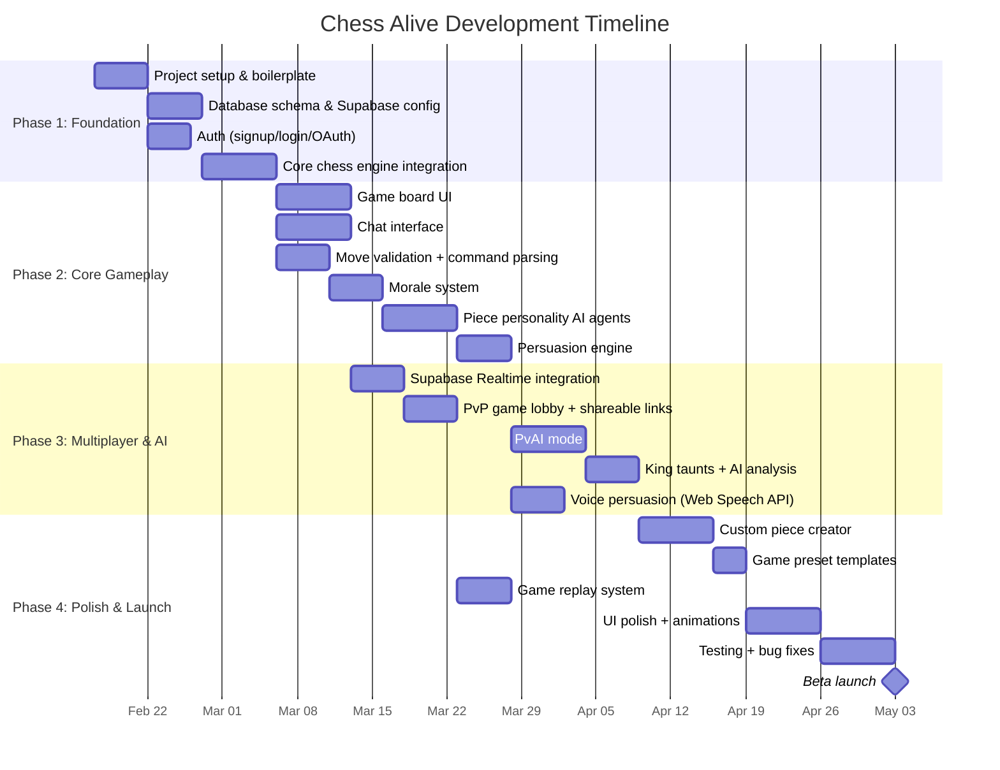

# 1. Executive Summary

[← Back to PRD Index](./readme.md) | [Next: Product Requirements →](./02-product-requirements.md)

---

## 1.1 Project Overview & Vision

**Chess Alive** is a web-based multiplayer chess game that reimagines classic chess by giving every piece an AI-powered personality, a morale system, and the ability to accept or refuse player commands. Players interact with their army through a group chat interface, using text and voice to persuade, command, and negotiate with their pieces in real-time.

The game combines the deep strategic roots of chess with social party-game dynamics—creating an experience where psychological management is as critical as positional play. An opponent's King hurls taunts, an AI analyst provides move-by-move commentary, and every piece reacts emotionally to the unfolding battle.

### Core Concept

> *"What if your chess pieces had feelings—and could say no?"*

Instead of silently clicking pieces into position, players tag pieces in a group chat:

```
You:     "@Knight move to f3"
Knight:  "Finally getting some action! On my way!" ✓

You:     "@Pawn move forward and attack their Queen"
Pawn:    "That's suicide! I'll die instantly. No way." ✗

You:     "Trust me, their Queen will have to retreat, opening up our attack"
Pawn:    "...Fine. But you better be right about this."
```

This creates emergent narrative moments: a Knight refusing a sacrifice, a pawn gang rallying before a promotion push, or a demoralized Queen throwing shade at your decision-making.

---

## 1.2 Target Audience

| Segment | Description | Key Motivation |
|---------|-------------|----------------|
| **Casual Gamers** | Ages 16–35, social media savvy, enjoy party/social games | Hilarious piece interactions, shareable moments, low barrier to entry |
| **Chess Enthusiasts** | Intermediate players who enjoy chess but want variety | Novel chess variant mechanics, AI analysis as a learning tool |
| **Party Game Players** | Friend groups looking for fun multiplayer experiences | Voice persuasion, trash-talking Kings, unexpected piece rebellions |
| **Content Creators** | Streamers and YouTubers seeking unique game content | Highly watchable, unpredictable, commentary-rich gameplay |
| **AI/Tech Enthusiasts** | People interested in AI-driven game experiences | Novel use of LLMs, personality-driven agents, custom piece generation |

### User Personas

**Persona 1: "Alex the Casual"**
- Age 22, plays games on phone during commute
- Knows basic chess rules but isn't competitive
- Loves the idea of arguing with digital pawns
- Will share funny piece responses on social media

**Persona 2: "Priya the Competitor"**
- Age 28, rated ~1400 on chess.com
- Wants a new chess experience with strategic depth
- Appreciates the AI analysis and morale management layer
- Will optimize morale strategies like they optimize openings

**Persona 3: "Jordan the Streamer"**
- Age 25, streams variety games on Twitch
- Sees viral potential in voice-arguing with chess pieces
- Will create content around custom themed armies
- Brings audience to the game

---

## 1.3 Key Differentiators from Traditional Chess

| Traditional Chess | Chess Alive |
|-------------------|------------|
| Silent, solitary interaction | Group chat with every piece |
| Pieces always obey | Pieces accept or refuse based on morale |
| Pure calculation | Calculation + psychological management |
| No narrative | Emergent stories from AI-driven piece reactions |
| No communication between players in-game | Opponent King taunts in real-time |
| Standard pieces only | Custom AI-generated themed armies |
| No post-move feedback | AI analyst provides quality scores and commentary |
| Text input only | Text + voice persuasion mechanics |
| One game mode | Classic, Power Chess, Leaper Madness, Hopper Havoc, Pawn Revolution |

### Unique Selling Points

1. **AI-Powered Personalities** — Every piece is a distinct character with opinions, not just a game token
2. **Morale System** — Adds a resource management layer to chess strategy
3. **Voice Persuasion** — Speak to convince a reluctant piece, adding physicality to a digital game
4. **Opponent King Taunts** — Built-in psychological warfare from the other side
5. **Custom Piece Generation** — Create themed armies (Space Marines, Historical Generals, Anime Characters)
6. **Party Game + Strategy Game Hybrid** — Fun enough for casual players, deep enough for chess fans
7. **Built-in AI Analysis** — Learn chess while being entertained by piece commentary

---

## 1.4 Success Metrics

### Primary KPIs

| Metric | Target (3 months) | Target (6 months) | Target (12 months) |
|--------|--------------------|--------------------|---------------------|
| Daily Active Users (DAU) | 500 | 2,000 | 10,000 |
| Monthly Active Users (MAU) | 5,000 | 20,000 | 80,000 |
| Game Completion Rate | 70% | 75% | 80% |
| D1 Retention | 30% | 35% | 40% |
| D7 Retention | 15% | 20% | 25% |
| D30 Retention | 8% | 12% | 15% |
| Avg. Games per User per Week | 3 | 5 | 7 |

### Secondary KPIs

| Metric | Target |
|--------|--------|
| Avg. game duration | 8–15 minutes |
| Persuasion attempts per game | 3–5 |
| Voice usage rate | 20%+ of persuasion attempts |
| Custom piece creation rate | 30%+ of users |
| Rematch rate | 40%+ |
| Social shares | 10%+ of completed games |
| Avg. chat messages per game | 30+ |
| PvP vs PvAI ratio | 60:40 |

### North Star Metric

**"Laugh-per-game ratio"** — Average number of piece interaction moments rated as entertaining (measured by session length, rematch rate, and social shares). If players are laughing and coming back, the game is succeeding.

---

## 1.5 Project Timeline & Milestones



### Phase Summary

| Phase | Duration | Key Deliverables |
|-------|----------|-----------------|
| **Phase 1: Foundation** | ~3 weeks | Project setup, auth, database, chess engine |
| **Phase 2: Core Gameplay** | ~5 weeks | Board UI, chat, morale, personalities, persuasion |
| **Phase 3: Multiplayer & AI** | ~4 weeks | Realtime PvP, PvAI, King taunts, voice input |
| **Phase 4: Polish & Launch** | ~4 weeks | Custom pieces, templates, replay, testing, beta |
| **Total estimated** | **~16 weeks** | Full beta-ready release |

### Key Milestones

| Milestone | Target Date | Criteria |
|-----------|------------|----------|
| **M1: Playable Prototype** | Week 6 | Single-player can command pieces in chat, morale works, board renders |
| **M2: AI Integration** | Week 9 | Pieces respond with AI personalities, persuasion engine operational |
| **M3: Multiplayer Beta** | Week 12 | PvP with realtime sync, PvAI mode functional |
| **M4: Feature Complete** | Week 14 | Custom pieces, voice, replays, all game modes |
| **M5: Beta Launch** | Week 16 | Tested, polished, deployed to production |

---

## 1.6 Assumptions & Constraints

### Assumptions

- Users have a modern web browser (Chrome, Firefox, Safari, Edge — latest 2 versions)
- Google Gemini 3 Flash API remains available and affordable during development
- Supabase free/pro tier can handle initial traffic loads
- Web Speech API is supported in target browsers (Chrome, Edge; limited in Firefox/Safari)
- Average game duration of 8–15 minutes is acceptable for target audience

### Constraints

- **Budget:** AI API costs must be managed through caching and rate limiting
- **Browser Support:** Web Speech API has inconsistent cross-browser support — must provide text fallback
- **Latency:** AI responses must feel near-instant (<2 seconds) to maintain game flow
- **Complexity:** Custom chess variants (hybrid pieces) add significant validation complexity
- **Content Moderation:** Custom piece prompts and voice input need content filtering

---

[← Back to PRD Index](./readme.md) | [Next: Product Requirements →](./02-product-requirements.md)
