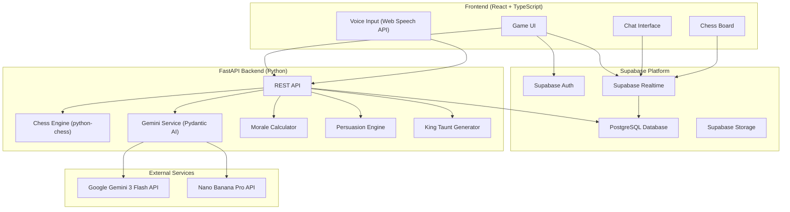
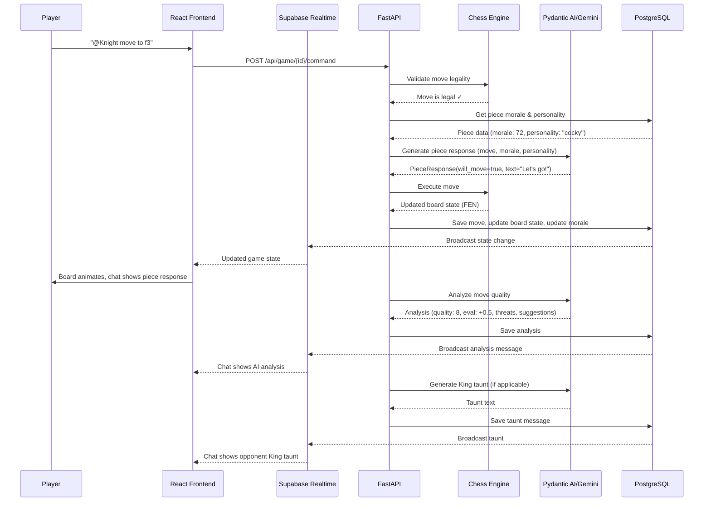
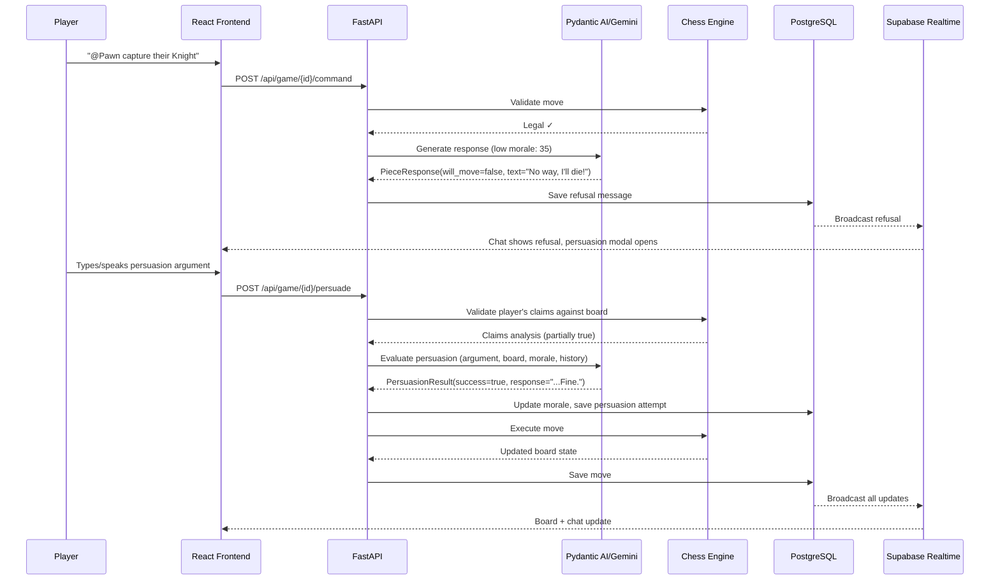
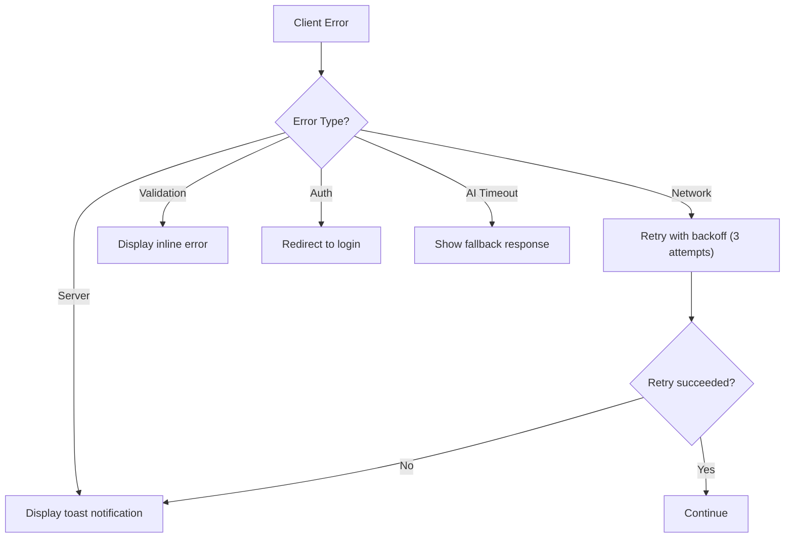
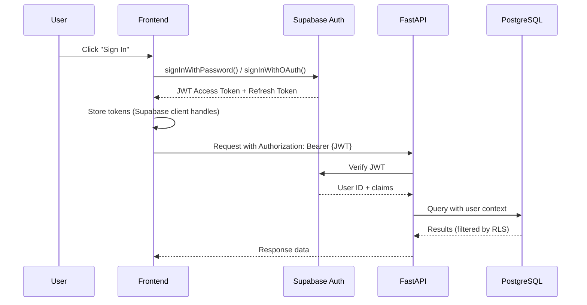

# 3. System Architecture

[← Back to PRD Index](./readme.md) | [Previous: Product Requirements](./02-product-requirements.md) | [Next: Database Design →](./04-database-design.md)

---

## 3.1 High-Level Architecture



### Architecture Principles

1. **Separation of Concerns** — Frontend handles presentation and local state; backend handles game logic, AI orchestration, and validation
2. **Realtime-First** — All game state changes flow through Supabase Realtime channels for instant synchronization
3. **AI as a Service** — All AI interactions are centralized in the backend through Pydantic AI agents
4. **Stateless Backend** — FastAPI instances are stateless; all state lives in PostgreSQL
5. **Optimistic Updates** — Frontend updates immediately on user action; backend validates and corrects if needed

---

## 3.2 Data Flow Architecture

### Move Execution Flow



### Persuasion Flow



---

## 3.3 Component Breakdown

### Frontend Components (React + TypeScript)

| Component | Location | Responsibility |
|-----------|----------|----------------|
| `App.tsx` | `/src/App.tsx` | Root component, routing (React Router), auth context provider |
| `GameBoard.tsx` | `/src/components/game/` | Chess board rendering, piece dragging, move highlighting |
| `PieceCard.tsx` | `/src/components/game/` | Individual piece display with morale bar, personality icon |
| `MoraleTracker.tsx` | `/src/components/game/` | Visual morale display for all 16 pieces |
| `ChatInterface.tsx` | `/src/components/chat/` | Group chat UI with message types, @-mention autocomplete |
| `MessageBubble.tsx` | `/src/components/chat/` | Styled message component (player/piece/AI/King variants) |
| `VoiceInput.tsx` | `/src/components/chat/` | Web Speech API wrapper with recording indicator |
| `PersuasionModal.tsx` | `/src/components/modals/` | Text/voice persuasion UI with success probability |
| `CustomPieceModal.tsx` | `/src/components/modals/` | AI piece generation interface with preview |
| `AIAnalysisPanel.tsx` | `/src/components/game/` | Move analysis display (quality, eval, threats, suggestions) |
| `MoveHistory.tsx` | `/src/components/game/` | Scrollable move log with notation |

#### Custom Hooks

| Hook | Location | Responsibility |
|------|----------|----------------|
| `useSupabase.ts` | `/src/hooks/` | Supabase client singleton, auth state |
| `useGameState.ts` | `/src/hooks/` | Game state management, board state, turn tracking |
| `useRealtimeChat.ts` | `/src/hooks/` | Subscribe to chat channel, manage message list |
| `useVoiceRecognition.ts` | `/src/hooks/` | Web Speech API lifecycle, recording state |
| `useMorale.ts` | `/src/hooks/` | Piece morale state, subscribe to morale changes |
| `useChessLogic.ts` | `/src/hooks/` | chess.js wrapper, legal move calculation, FEN parsing |

#### Pages

| Page | Route | Description |
|------|-------|-------------|
| `Home.tsx` | `/` | Landing page, play buttons, recent games |
| `GameLobby.tsx` | `/lobby/:gameId` | Pre-game setup, template selection, customization |
| `Game.tsx` | `/game/:gameId` | Main game screen (board + chat + analysis) |
| `Profile.tsx` | `/profile/:userId` | User stats, game history, settings |
| `Login.tsx` | `/login` | Sign in / Sign up page |

### Backend Services (FastAPI)

| Module | Location | Responsibility |
|--------|----------|----------------|
| `main.py` | `/app/` | FastAPI app, CORS, middleware, lifespan |
| `game.py` | `/app/routers/` | Game CRUD, move commands, persuasion endpoints |
| `ai.py` | `/app/routers/` | AI analysis, piece responses, custom piece generation |
| `chat.py` | `/app/routers/` | Chat message handling, history retrieval |
| `auth.py` | `/app/routers/` | Auth middleware, user management endpoints |
| `chess_engine.py` | `/app/services/` | python-chess wrapper: move validation, FEN management, board analysis |
| `gemini_service.py` | `/app/services/` | Pydantic AI agent orchestration, prompt management |
| `morale_calculator.py` | `/app/services/` | Morale update logic, event-based morale changes |
| `persuasion_engine.py` | `/app/services/` | Persuasion success calculation, argument validation |
| `king_taunts.py` | `/app/services/` | Contextual taunt generation based on game state |
| `supabase_client.py` | `/app/db/` | Supabase client initialization, connection management |
| `queries.py` | `/app/db/` | Database query functions (games, pieces, chat) |
| `config.py` | `/app/core/` | Environment variable loading, app settings |
| `security.py` | `/app/core/` | JWT verification, auth dependency injection |

---

## 3.4 Folder Structure

### Frontend

```
/frontend
├── /public
│   ├── favicon.ico
│   ├── index.html
│   └── /assets
│       ├── /pieces          # Chess piece SVGs/PNGs
│       └── /sounds          # Move sounds, notifications
├── /src
│   ├── /components
│   │   ├── /game
│   │   │   ├── GameBoard.tsx
│   │   │   ├── GameBoard.css
│   │   │   ├── PieceCard.tsx
│   │   │   ├── MoraleTracker.tsx
│   │   │   ├── MoveHistory.tsx
│   │   │   └── AIAnalysisPanel.tsx
│   │   ├── /chat
│   │   │   ├── ChatInterface.tsx
│   │   │   ├── ChatInterface.css
│   │   │   ├── MessageBubble.tsx
│   │   │   └── VoiceInput.tsx
│   │   ├── /modals
│   │   │   ├── PersuasionModal.tsx
│   │   │   └── CustomPieceModal.tsx
│   │   ├── /ui              # shadcn/ui base components
│   │   │   ├── Button.tsx
│   │   │   ├── Input.tsx
│   │   │   ├── Modal.tsx
│   │   │   ├── Tooltip.tsx
│   │   │   └── Spinner.tsx
│   │   └── /layout
│   │       ├── Header.tsx
│   │       ├── Footer.tsx
│   │       └── Layout.tsx
│   ├── /hooks
│   │   ├── useSupabase.ts
│   │   ├── useGameState.ts
│   │   ├── useRealtimeChat.ts
│   │   ├── useVoiceRecognition.ts
│   │   ├── useMorale.ts
│   │   └── useChessLogic.ts
│   ├── /services
│   │   ├── supabase.ts       # Supabase client init
│   │   └── api.ts            # FastAPI HTTP client (axios/fetch wrapper)
│   ├── /types
│   │   ├── game.types.ts
│   │   ├── piece.types.ts
│   │   ├── chat.types.ts
│   │   └── api.types.ts
│   ├── /utils
│   │   ├── chessLogic.ts     # chess.js wrapper utilities
│   │   ├── constants.ts
│   │   └── helpers.ts
│   ├── /pages
│   │   ├── Home.tsx
│   │   ├── GameLobby.tsx
│   │   ├── Game.tsx
│   │   ├── Profile.tsx
│   │   └── Login.tsx
│   ├── /context
│   │   ├── AuthContext.tsx
│   │   └── GameContext.tsx
│   ├── App.tsx
│   ├── App.css
│   ├── main.tsx
│   └── index.css
├── package.json
├── tsconfig.json
├── vite.config.ts
├── tailwind.config.js
├── .eslintrc.js
├── .prettierrc
└── README.md
```

### Backend

```
/backend
├── /app
│   ├── __init__.py
│   ├── main.py               # FastAPI app, CORS, middleware
│   ├── /routers
│   │   ├── __init__.py
│   │   ├── game.py           # Game CRUD, move validation
│   │   ├── ai.py             # AI analysis, piece responses
│   │   ├── chat.py           # Chat message handling
│   │   └── auth.py           # Auth endpoints
│   ├── /services
│   │   ├── __init__.py
│   │   ├── chess_engine.py   # python-chess wrapper
│   │   ├── gemini_service.py # Pydantic AI + Gemini agents
│   │   ├── morale_calculator.py
│   │   ├── persuasion_engine.py
│   │   └── king_taunts.py
│   ├── /models
│   │   ├── __init__.py
│   │   ├── game_models.py    # Pydantic request/response models
│   │   ├── piece_models.py
│   │   ├── chat_models.py
│   │   └── ai_models.py
│   ├── /db
│   │   ├── __init__.py
│   │   ├── supabase_client.py
│   │   └── queries.py
│   ├── /core
│   │   ├── __init__.py
│   │   ├── config.py         # Settings (pydantic-settings)
│   │   └── security.py       # JWT auth, dependencies
│   ├── /utils
│   │   ├── __init__.py
│   │   ├── validators.py
│   │   └── constants.py
│   └── /tests
│       ├── __init__.py
│       ├── conftest.py       # Fixtures
│       ├── test_chess_engine.py
│       ├── test_morale.py
│       ├── test_persuasion.py
│       ├── test_game_router.py
│       └── test_ai_router.py
├── requirements.txt
├── pyproject.toml
├── .env.example
├── Dockerfile
└── README.md
```

---

## 3.5 Technology Decision Records

### Why Supabase over Firebase?

| Factor | Supabase | Firebase |
|--------|-----------|---------|
| Database | PostgreSQL (SQL, relational) | Firestore (NoSQL, document) |
| Auth | Built-in, easy JWT | Built-in, similar |
| Realtime | PostgreSQL Changes + Broadcast | Realtime Database |
| RLS | Native PostgreSQL RLS | Firestore Security Rules |
| Self-hosting | Possible | Not possible |
| Pricing | Generous free tier | Generous free tier |
| **Decision** | ✅ Chosen — Relational data (games, moves, pieces) fits SQL naturally. RLS is more powerful. |

### Why FastAPI over Express/Next.js API Routes?

| Factor | FastAPI | Express | Next.js API |
|--------|---------|---------|-------------|
| Language | Python | JavaScript | JavaScript |
| Type safety | Pydantic (excellent) | Manual/Zod | Manual/Zod |
| AI Integration | Native Python ML ecosystem | Requires bridge | Requires bridge |
| Chess Engine | python-chess (mature) | chess.js (mature) | chess.js (mature) |
| Pydantic AI | Native support | Not available | Not available |
| Performance | Async, fast | Async, fast | Serverless overhead |
| **Decision** | ✅ Chosen — Python ecosystem for AI (Pydantic AI, python-chess) is dominant. |

### Why chess.js (frontend) + python-chess (backend)?

- **Frontend (chess.js):** Immediate move highlighting, legal move display, optimistic UI updates
- **Backend (python-chess):** Authoritative validation, deep analysis, integration with Pydantic AI
- **Redundancy:** Frontend chess.js prevents sending obviously illegal moves; backend python-chess is the source of truth

---

## 3.6 Cross-Cutting Concerns

### Error Handling Strategy



### Logging Strategy

- **Frontend:** Console + optional Sentry integration for production errors
- **Backend:** Python `logging` with structured JSON format, request correlation IDs
- **Database:** Supabase dashboard for query performance monitoring

### Authentication Flow



---

[← Back to PRD Index](./readme.md) | [Previous: Product Requirements](./02-product-requirements.md) | [Next: Database Design →](./04-database-design.md)
