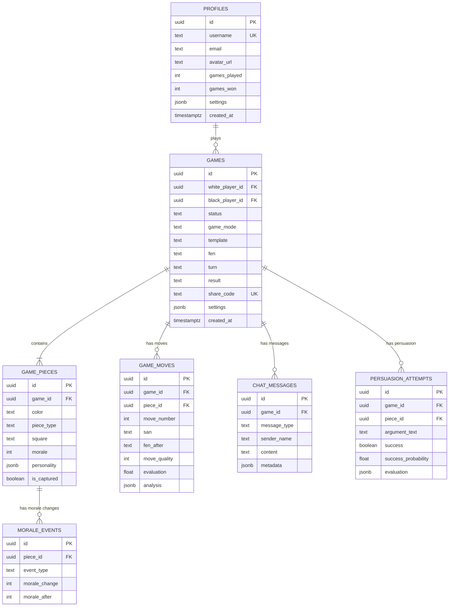

# 4. Database Design

[← Back to PRD Index](./readme.md) | [Previous: System Architecture](./03-system-architecture.md) | [Next: API Design →](./05-api-design.md)

---

## 4.1 Entity-Relationship Diagram



---

## 4.2 Table Definitions

### `profiles`

Extends Supabase `auth.users`. Auto-created on signup via trigger.

| Column | Type | Constraints | Default | Description |
|--------|------|-------------|---------|-------------|
| id | UUID | PK, FK → auth.users | — | Supabase user ID |
| username | TEXT | UNIQUE, NOT NULL | "player_" + id prefix | Display name |
| email | TEXT | NOT NULL | — | User email |
| avatar_url | TEXT | — | NULL | Profile avatar |
| games_played | INT | — | 0 | Total games |
| games_won | INT | — | 0 | Wins |
| games_lost | INT | — | 0 | Losses |
| games_drawn | INT | — | 0 | Draws |
| settings | JSONB | — | `{theme, sound, voice, contrast, motion}` | User preferences |
| created_at | TIMESTAMPTZ | — | NOW() | Registration time |
| updated_at | TIMESTAMPTZ | — | NOW() | Last update |

**Auto-create trigger:** On `auth.users` INSERT, creates profile with username from metadata or generated default.

### `games`

| Column | Type | Constraints | Default | Description |
|--------|------|-------------|---------|-------------|
| id | UUID | PK | gen_random_uuid() | Game ID |
| white_player_id | UUID | FK → profiles | — | White player |
| black_player_id | UUID | FK → profiles | — | Black player (NULL while waiting) |
| status | TEXT | CHECK: waiting/setup/active/completed/abandoned | 'waiting' | Game state |
| game_mode | TEXT | CHECK: pvp/pvai | 'pvp' | Mode |
| template | TEXT | CHECK: classic/power_chess/leaper_madness/hopper_havoc/pawn_revolution | 'classic' | Piece template |
| fen | TEXT | NOT NULL | Starting FEN | Current board position |
| pgn | TEXT | — | '' | Move history (PGN) |
| turn | TEXT | CHECK: white/black | 'white' | Current turn |
| result | TEXT | CHECK: NULL/white_wins/black_wins/draw/stalemate/abandoned | NULL | Outcome |
| settings | JSONB | — | `{surprise_mode, turn_timer, ai_difficulty}` | Game config |
| share_code | TEXT | UNIQUE | Random 12-char hex | Shareable join code |
| created_at | TIMESTAMPTZ | — | NOW() | Created |
| updated_at | TIMESTAMPTZ | — | NOW() | Last update |
| finished_at | TIMESTAMPTZ | — | NULL | Completion time |

### `game_pieces`

| Column | Type | Constraints | Default | Description |
|--------|------|-------------|---------|-------------|
| id | UUID | PK | gen_random_uuid() | Piece ID |
| game_id | UUID | FK → games, ON DELETE CASCADE | — | Parent game |
| color | TEXT | CHECK: white/black | — | Piece color |
| piece_type | TEXT | CHECK: pawn/knight/bishop/rook/queen/king + variants | — | Piece type |
| square | TEXT | — | Starting square | Current square (NULL if captured) |
| morale | INT | CHECK: 0–100 | 70 | Morale score |
| personality | JSONB | NOT NULL | `{archetype, traits, dialogue_style}` | Personality config |
| custom_config | JSONB | — | NULL | Custom piece gen data |
| is_captured | BOOLEAN | — | FALSE | Capture status |
| is_promoted | BOOLEAN | — | FALSE | Promotion status |
| promoted_to | TEXT | — | NULL | Promoted piece type |

### `game_moves`

| Column | Type | Constraints | Default | Description |
|--------|------|-------------|---------|-------------|
| id | UUID | PK | gen_random_uuid() | Move ID |
| game_id | UUID | FK → games, CASCADE | — | Parent game |
| piece_id | UUID | FK → game_pieces | — | Moved piece |
| player_id | UUID | FK → profiles | — | Player who moved |
| move_number | INT | NOT NULL | — | Sequential move count |
| from_square | TEXT | NOT NULL | — | Origin square |
| to_square | TEXT | NOT NULL | — | Destination square |
| san | TEXT | NOT NULL | — | Standard Algebraic Notation |
| fen_after | TEXT | NOT NULL | — | Board position after move |
| move_quality | INT | CHECK: 1–10 | — | AI-assessed quality |
| evaluation | FLOAT | — | — | Centipawn evaluation |
| analysis | JSONB | — | — | Threats, opportunities, text |

### `chat_messages`

| Column | Type | Constraints | Default | Description |
|--------|------|-------------|---------|-------------|
| id | UUID | PK | gen_random_uuid() | Message ID |
| game_id | UUID | FK → games, CASCADE | — | Parent game |
| sender_id | UUID | FK → profiles | NULL | Sender (NULL for AI/system) |
| message_type | TEXT | CHECK (see below) | — | Message category |
| sender_name | TEXT | NOT NULL | — | Display name |
| content | TEXT | NOT NULL | — | Message text |
| metadata | JSONB | — | {} | Extra data per type |
| created_at | TIMESTAMPTZ | — | NOW() | Timestamp |

**message_type values:** `player_command`, `player_message`, `piece_response`, `piece_refusal`, `ai_analysis`, `ai_suggestion`, `king_taunt`, `king_reaction`, `system`, `persuasion_attempt`, `persuasion_result`

### `persuasion_attempts`

| Column | Type | Description |
|--------|------|-------------|
| id | UUID | PK |
| game_id | UUID | FK → games |
| piece_id | UUID | FK → game_pieces |
| player_id | UUID | FK → profiles |
| argument_text | TEXT | Player's persuasion argument |
| is_voice | BOOLEAN | Was this a voice input? |
| success | BOOLEAN | Did persuasion succeed? |
| success_probability | FLOAT | Calculated probability (0–1) |
| piece_response | TEXT | Piece's response text |
| evaluation | JSONB | Breakdown: logic_score, personality_match, morale_modifier, trust_modifier, urgency_factor |

### `morale_events`

| Column | Type | Description |
|--------|------|-------------|
| id | UUID | PK |
| game_id | UUID | FK → games |
| piece_id | UUID | FK → game_pieces |
| event_type | TEXT | CHECK: capture_enemy, friendly_captured, endangered, protected, blunder, idle, compliment, promotion, etc. |
| morale_change | INT | Delta (+/-) |
| morale_after | INT | CHECK: 0–100. Morale after change |
| description | TEXT | Human-readable description |

---

## 4.3 Indexes

```sql
-- Games: player lookups, status filtering, join codes
CREATE INDEX idx_games_white_player ON games(white_player_id);
CREATE INDEX idx_games_black_player ON games(black_player_id);
CREATE INDEX idx_games_status ON games(status);
CREATE INDEX idx_games_share_code ON games(share_code);

-- Pieces: game lookup, active pieces
CREATE INDEX idx_pieces_game ON game_pieces(game_id);
CREATE INDEX idx_pieces_game_color ON game_pieces(game_id, color);

-- Moves: game history
CREATE INDEX idx_moves_game ON game_moves(game_id);
CREATE INDEX idx_moves_game_number ON game_moves(game_id, move_number);

-- Chat: message pagination
CREATE INDEX idx_chat_game_created ON chat_messages(game_id, created_at DESC);

-- Persuasion & Morale: game/piece lookups
CREATE INDEX idx_persuasion_game ON persuasion_attempts(game_id);
CREATE INDEX idx_morale_piece ON morale_events(piece_id);
```

---

## 4.4 Row Level Security (RLS)

| Table | SELECT | INSERT | UPDATE |
|-------|--------|--------|--------|
| `profiles` | Anyone can read all | Trigger-only (SECURITY DEFINER) | Only own profile (`auth.uid() = id`) |
| `games` | Participants + waiting games | Authenticated (`auth.uid() = white_player_id`) | Participants only |
| `game_pieces` | Game participants (via JOIN on games) | Backend service role | Backend service role |
| `chat_messages` | Game participants | Game participants (`auth.uid() = sender_id`) | None |
| `persuasion_attempts` | Game participants | Backend service role | None |
| `morale_events` | Game participants | Backend service role | None |

All participant checks use:
```sql
EXISTS (SELECT 1 FROM games WHERE games.id = table.game_id
  AND (games.white_player_id = auth.uid() OR games.black_player_id = auth.uid()))
```

---

## 4.5 Realtime Channels

| Channel | Type | Purpose | Events |
|---------|------|---------|--------|
| `game:{gameId}` | Broadcast | Board state, turns, status | `game_state` |
| `chat:{gameId}` | Postgres Changes | New messages | INSERT on `chat_messages` filtered by game_id |
| `pieces:{gameId}` | Postgres Changes | Morale/capture updates | UPDATE on `game_pieces` filtered by game_id |

---

## 4.6 Triggers & Functions

1. **`handle_new_user()`** — After INSERT on `auth.users`, creates `profiles` row
2. **`update_updated_at()`** — Before UPDATE on games/profiles/pieces, sets `updated_at = NOW()`
3. **`update_player_stats()`** — After UPDATE on `games` when `status` changes to `completed`, increments player win/loss/draw counts

---

## 4.7 Migration Order

1. `001_create_profiles.sql`
2. `002_create_games.sql`
3. `003_create_game_pieces.sql`
4. `004_create_game_moves.sql`
5. `005_create_chat_messages.sql`
6. `006_create_persuasion_attempts.sql`
7. `007_create_morale_events.sql`
8. `008_create_indexes.sql`
9. `009_create_rls_policies.sql`
10. `010_create_functions_triggers.sql`

---

[← Back to PRD Index](./readme.md) | [Previous: System Architecture](./03-system-architecture.md) | [Next: API Design →](./05-api-design.md)
