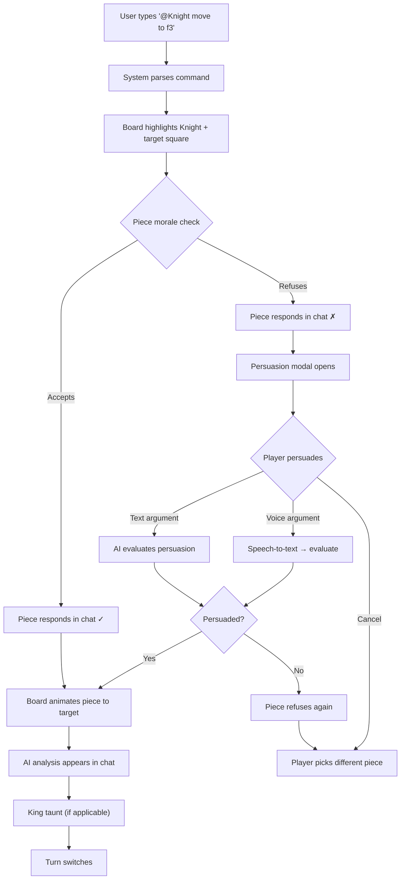

# 7. UI/UX Design

[← Back to PRD Index](./readme.md) | [Previous: AI Integration](./06-ai-integration.md) | [Next: Testing Strategy →](./08-testing-strategy.md)

---

## 7.1 Design System

### Color Palette

| Token | Light Mode | Dark Mode (Default) | Purpose |
|-------|-----------|---------------------|---------|
| `--bg-primary` | `#F5F5F5` | `#121212` | Page background |
| `--bg-secondary` | `#FFFFFF` | `#1E1E1E` | Cards, panels |
| `--bg-board-light` | `#F0D9B5` | `#B58863` | Light board squares |
| `--bg-board-dark` | `#B58863` | `#6F4E37` | Dark board squares |
| `--text-primary` | `#1A1A1A` | `#E0E0E0` | Primary text |
| `--text-secondary` | `#666666` | `#999999` | Secondary text |
| `--accent-primary` | `#4A90D9` | `#5BA8F5` | Primary actions, links |
| `--accent-success` | `#27AE60` | `#2ECC71` | High morale, good moves |
| `--accent-warning` | `#F39C12` | `#F1C40F` | Medium morale, warnings |
| `--accent-danger` | `#E74C3C` | `#E74C3C` | Low morale, blunders |
| `--chat-player` | `#4A90D9` | `#3D7ABD` | Player message bubbles |
| `--chat-piece` | `#8E44AD` | `#9B59B6` | Piece message bubbles |
| `--chat-ai` | `#27AE60` | `#2ECC71` | AI analysis bubbles |
| `--chat-king` | `#E74C3C` | `#C0392B` | King taunt bubbles |
| `--chat-system` | `#95A5A6` | `#7F8C8D` | System messages |

### Typography

| Element | Font | Size | Weight |
|---------|------|------|--------|
| H1 (Page title) | Inter | 32px | 700 |
| H2 (Section) | Inter | 24px | 600 |
| H3 (Subsection) | Inter | 20px | 600 |
| Body | Inter | 16px | 400 |
| Chat messages | Inter | 14px | 400 |
| Piece names | Inter | 14px | 600 |
| Move notation | JetBrains Mono | 14px | 400 |
| Morale numbers | JetBrains Mono | 12px | 500 |

### Spacing Scale

`4px`, `8px`, `12px`, `16px`, `24px`, `32px`, `48px`, `64px`

### Component Library

Base: **shadcn/ui** (Radix UI primitives + Tailwind)

Custom chess-specific components built on top:
- `GameBoard` — Interactive chess board with piece rendering
- `MoraleMeter` — Circular/bar morale indicator per piece
- `ChatBubble` — Colored message bubble by sender type
- `PieceAvatar` — Small piece icon with morale color ring
- `PersuasionSlider` — Success probability visualization

---

## 7.2 Responsive Design

### Breakpoints

| Breakpoint | Width | Layout |
|------------|-------|--------|
| Mobile | 320–768px | Stacked: board on top, chat below |
| Tablet | 769–1024px | Side-by-side: smaller board (50%) + chat (50%) |
| Desktop | 1025px+ | Optimal side-by-side: board (60%) + chat (40%) |

### Mobile Adaptations

- **Board:** Full-width, touch-friendly (minimum 44px tap targets)
- **Chat:** Collapsible bottom panel (swipe up to expand)
- **Persuasion:** Bottom sheet modal instead of centered popup
- **Voice button:** Floating action button (FAB), bottom-right
- **Morale tracker:** Horizontal scrollable bar above board
- **Move history:** Hidden by default, accessible via menu

### Desktop Layout

```
┌──────────────────────────────────────────────────┐
│  Header: Logo | Game Timer | Settings            │
├──────────────────────┬───────────────────────────┤
│                      │  Chat Interface           │
│  Morale Tracker      │  ┌───────────────────┐   │
│  ┌──────────────┐    │  │ AI: ✅ Strong Nf3  │   │
│  │ ♞72  ♝85  ♜68│    │  │ Knight: On my way! │   │
│  └──────────────┘    │  │ ♚King: Predictable │   │
│                      │  │ You: @Bishop e5     │   │
│   Chess Board        │  │ Bishop: Hmm, risky │   │
│  ┌──────────────┐    │  └───────────────────┘   │
│  │              │    │                           │
│  │   8×8 Grid   │    │  ┌─────────────────────┐ │
│  │              │    │  │ Type @piece command  │ │
│  │              │    │  │              🎤 Send │ │
│  └──────────────┘    │  └─────────────────────┘ │
│                      │                           │
│  Move History        │  AI Analysis Panel        │
│  1. Nf3  d5          │  📊 Eval: +0.5           │
│  2. d4   Nf6         │  🎯 Threats: none         │
└──────────────────────┴───────────────────────────┘
```

---

## 7.3 Key Screens & User Flows

### Screen 1: Home Page

**Purpose:** Landing page, primary entry point

**Elements:**
- Hero section with game tagline and animated chess piece characters
- Two primary CTAs: "Play vs Friend" / "Play vs AI"
- Secondary: "How It Works" section with 3-step walkthrough
- Recent games (if logged in)
- Sign in/Sign up buttons (top-right)

### Screen 2: Game Lobby

**Purpose:** Pre-game setup and waiting room

**Elements:**
- Template selector (dropdown: Classic, Power Chess, etc.)
- Piece customization button → opens Custom Piece Modal
- "Surprise Mode" toggle switch
- Share link with copy button (PvP)
- AI difficulty selector (PvAI)
- Timer setting
- "Start Game" / "Waiting for opponent..." state
- Both player avatars + names shown when ready

### Screen 3: Main Game Screen

**Purpose:** Core gameplay — board + chat + analysis

**Layout:** See desktop layout diagram above

**Interactions:**
1. Player types `@piece command` in chat input
2. Chat auto-scrolls to show piece response
3. Board highlights relevant piece and legal moves
4. On acceptance: smooth piece animation (300ms ease-in-out)
5. On refusal: persuasion modal slides in
6. AI analysis appears in chat after move
7. King taunt may appear in chat

### Screen 4: Persuasion Modal

**Purpose:** Convince a reluctant piece

**Elements:**
- Piece avatar with name, morale bar, refusal message
- Text input area (placeholder: "Convince them...")
- 🎤 Voice record button (glowing when recording)
- Success probability indicator (percentage + bar, updates as user types)
- Send / Cancel buttons
- "Pick different piece" link

### Screen 5: Custom Piece Creator

**Purpose:** AI-generated themed piece personalities

**Elements:**
- Piece type selector (grid of piece icons)
- Theme prompt input (e.g., "Space Marines from Warhammer 40K")
- "Generate" button → loading spinner → preview
- Preview card: archetype name, traits, sample dialogue
- "Accept" / "Regenerate" buttons
- Gallery of saved custom pieces

### Screen 6: Post-Game Summary

**Purpose:** Game results and analysis

**Elements:**
- Result banner (Win/Loss/Draw + method)
- Move quality chart (line graph of move scores over time)
- Key moments carousel (best/worst moves with board snapshots)
- Persuasion stats (attempts, success rate)
- Morale timeline graph
- "Rematch" / "New Game" / "View Replay" buttons

---

## 7.4 Interaction Patterns

### Moving Pieces — Chat Command Flow



### Moving Pieces — Click-based Alternative

1. User clicks piece on board → legal moves highlight (green circles)
2. User clicks destination square
3. System auto-generates: `@Knight-g1 move to f3`
4. Flow continues as chat command (piece responds, etc.)

### Voice Persuasion Flow

1. User clicks 🎤 in persuasion modal
2. Pulsing red recording indicator appears
3. User speaks (max 15 seconds)
4. "Processing..." state with spinner
5. Transcribed text appears in input field
6. User can edit before sending, or send immediately
7. AI evaluates → piece responds

---

## 7.5 Animations

| Animation | Duration | Easing | Trigger |
|-----------|----------|--------|---------|
| Piece move | 300ms | ease-in-out | Move accepted |
| Piece capture | 200ms | ease-out | Piece removed from board |
| Chat message appear | 150ms | ease-out | New message |
| Morale bar change | 500ms | ease-in-out | Morale event |
| Persuasion modal | 250ms | ease-out | Piece refuses |
| Board highlight | 100ms | linear | Piece selected |
| Turn indicator | 300ms | ease | Turn change |
| Check flash | 500ms | pulse (2x) | King in check |

All animations respect `prefers-reduced-motion: reduce`.

---

## 7.6 Accessibility Features

### Keyboard Navigation

| Key | Action |
|-----|--------|
| Tab | Move focus through interactive elements |
| Arrow keys | Navigate board squares (row/column) |
| Enter | Select piece / confirm square |
| Escape | Cancel selection / close modal |
| `/` | Focus chat input |
| `Ctrl+M` | Toggle morale tracker |

### Screen Reader Announcements

- Board state: "White Knight on g1, morale 72"
- Move events: "Knight moves from g1 to f3. Knight says: 'On my way!'"
- Morale changes: "Knight morale increased by 10, now 82"
- Chat messages: Read message type + sender + content
- Check/checkmate: "White King is in check!"

### Visual Aids

- High contrast mode toggle in settings
- Color-blind safe morale indicators: shapes + colors (✦ high, ▬ medium, ✖ low)
- 2px solid focus outlines on all interactive elements
- Minimum 4.5:1 contrast ratio for all text

---

[← Back to PRD Index](./readme.md) | [Previous: AI Integration](./06-ai-integration.md) | [Next: Testing Strategy →](./08-testing-strategy.md)
