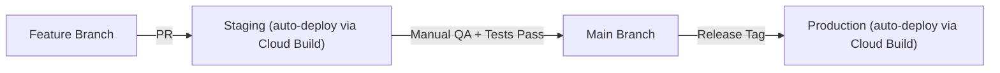
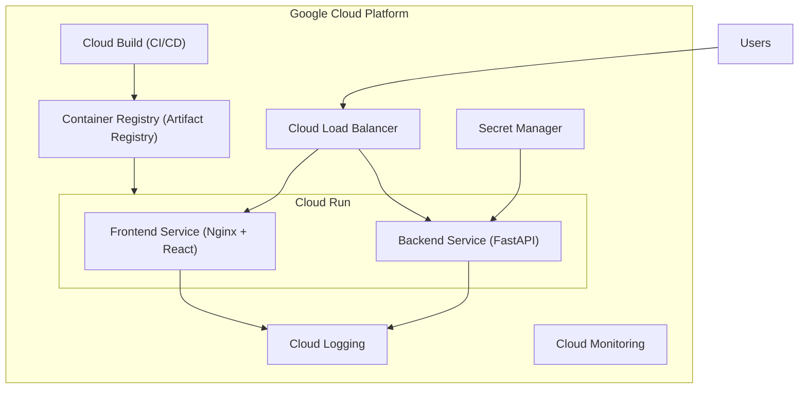
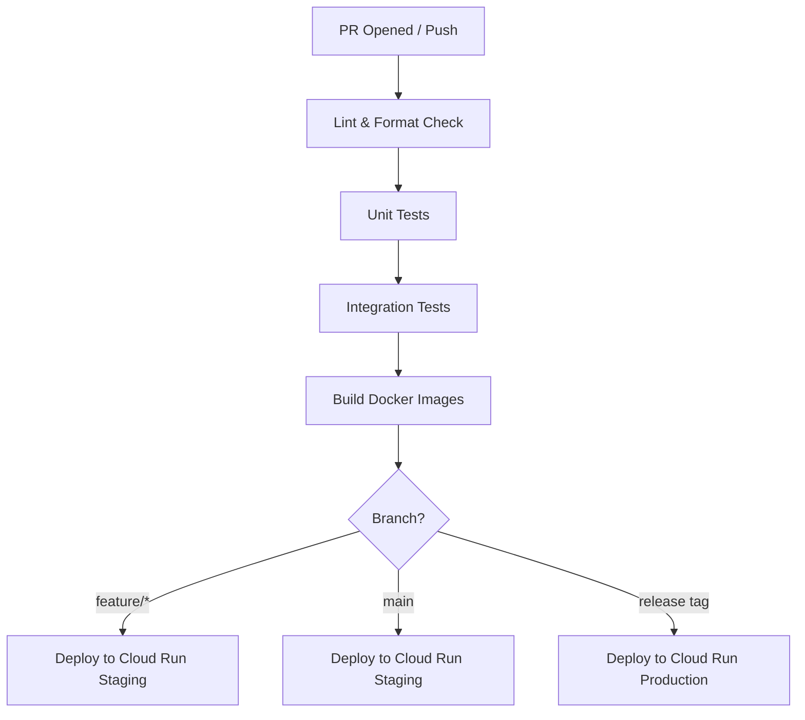

# 10. Deployment & Infrastructure

[← Back to PRD Index](./readme.md) | [Previous: Security](./09-security.md) | [Next: Configuration →](./11-configuration.md)

---

## 10.1 Environments

| Environment | Frontend | Backend | Database | Purpose |
|-------------|----------|---------|----------|---------|
| **Development** | `localhost:5173` (Vite) | `localhost:8000` (uvicorn) | Supabase Local (Docker) | Local development |
| **Staging** | Google Cloud Run (staging) | Google Cloud Run (staging) | Supabase Free Project | Integration testing, PR previews |
| **Production** | Google Cloud Run (prod) | Google Cloud Run (prod) | Supabase Pro | Live users |

### Environment Promotion Flow



### Google Cloud Run Architecture

Both frontend and backend are deployed as containerized services on **Google Cloud Run**:

- **Frontend Service:** Nginx container serving the Vite-built static assets
- **Backend Service:** Python container running FastAPI with Uvicorn
- **Auto-scaling:** Cloud Run scales from 0 to N instances based on traffic
- **Region:** Configurable (default: `asia-south1` for India-centric deployment)
- **Custom domain:** Map `chessalive.gg` via Cloud Run domain mappings



---

## 10.2 CI/CD Pipeline (GitHub Actions + Google Cloud Build)

### Pipeline Stages



### Workflow Configuration

```yaml
# .github/workflows/ci.yml
name: CI/CD Pipeline

on:
  push:
    branches: [main, develop]
  pull_request:
    branches: [main]
  release:
    types: [published]

jobs:
  lint:
    runs-on: ubuntu-latest
    steps:
      - uses: actions/checkout@v4
      - name: Frontend lint
        run: cd frontend && npm ci && npm run lint
      - name: Backend lint
        run: cd backend && pip install ruff black && ruff check . && black --check .

  test-frontend:
    needs: lint
    runs-on: ubuntu-latest
    steps:
      - uses: actions/checkout@v4
      - run: cd frontend && npm ci && npm test -- --coverage
      - name: Upload coverage
        uses: codecov/codecov-action@v3

  test-backend:
    needs: lint
    runs-on: ubuntu-latest
    steps:
      - uses: actions/checkout@v4
      - run: cd backend && pip install -r requirements.txt && pytest --cov=app

  build-and-deploy:
    needs: [test-frontend, test-backend]
    runs-on: ubuntu-latest
    permissions:
      contents: read
      id-token: write
    steps:
      - uses: actions/checkout@v4

      - name: Authenticate to Google Cloud
        uses: google-github-actions/auth@v2
        with:
          workload_identity_provider: ${{ secrets.GCP_WORKLOAD_IDENTITY_PROVIDER }}
          service_account: ${{ secrets.GCP_SERVICE_ACCOUNT }}

      - name: Set up Google Cloud CLI
        uses: google-github-actions/setup-gcloud@v2

      - name: Configure Docker for Artifact Registry
        run: gcloud auth configure-docker ${{ secrets.GCP_REGION }}-docker.pkg.dev

      - name: Build & push frontend image
        run: |
          docker build -t ${{ secrets.GCP_REGION }}-docker.pkg.dev/${{ secrets.GCP_PROJECT }}/chessalive/frontend:${{ github.sha }} ./frontend
          docker push ${{ secrets.GCP_REGION }}-docker.pkg.dev/${{ secrets.GCP_PROJECT }}/chessalive/frontend:${{ github.sha }}

      - name: Build & push backend image
        run: |
          docker build -t ${{ secrets.GCP_REGION }}-docker.pkg.dev/${{ secrets.GCP_PROJECT }}/chessalive/backend:${{ github.sha }} ./backend
          docker push ${{ secrets.GCP_REGION }}-docker.pkg.dev/${{ secrets.GCP_PROJECT }}/chessalive/backend:${{ github.sha }}

      - name: Deploy frontend to Cloud Run
        if: github.ref == 'refs/heads/main' || startsWith(github.ref, 'refs/tags/v')
        run: |
          gcloud run deploy chessalive-frontend \
            --image ${{ secrets.GCP_REGION }}-docker.pkg.dev/${{ secrets.GCP_PROJECT }}/chessalive/frontend:${{ github.sha }} \
            --region ${{ secrets.GCP_REGION }} \
            --allow-unauthenticated \
            --port 80

      - name: Deploy backend to Cloud Run
        if: github.ref == 'refs/heads/main' || startsWith(github.ref, 'refs/tags/v')
        run: |
          gcloud run deploy chessalive-backend \
            --image ${{ secrets.GCP_REGION }}-docker.pkg.dev/${{ secrets.GCP_PROJECT }}/chessalive/backend:${{ github.sha }} \
            --region ${{ secrets.GCP_REGION }} \
            --allow-unauthenticated \
            --port 8000 \
            --set-secrets=SUPABASE_SERVICE_KEY=supabase-service-key:latest,GOOGLE_GEMINI_API_KEY=gemini-api-key:latest,NANO_BANANA_API_KEY=nano-banana-key:latest
```

### Dockerfiles

**Frontend (`frontend/Dockerfile`):**
```dockerfile
FROM node:20-alpine AS build
WORKDIR /app
COPY package*.json ./
RUN npm ci
COPY . .
RUN npm run build

FROM nginx:alpine
COPY --from=build /app/dist /usr/share/nginx/html
COPY nginx.conf /etc/nginx/conf.d/default.conf
EXPOSE 80
```

**Backend (`backend/Dockerfile`):**
```dockerfile
FROM python:3.12-slim
WORKDIR /app
COPY requirements.txt .
RUN pip install --no-cache-dir -r requirements.txt
COPY . .
EXPOSE 8000
CMD ["uvicorn", "app.main:app", "--host", "0.0.0.0", "--port", "8000"]
```

---

## 10.3 Google Cloud CLI Commands

### Initial Setup

```bash
# Install Google Cloud CLI
# https://cloud.google.com/sdk/docs/install

# Authenticate
gcloud auth login
gcloud config set project YOUR_PROJECT_ID
gcloud config set run/region asia-south1

# Enable required APIs
gcloud services enable run.googleapis.com
gcloud services enable artifactregistry.googleapis.com
gcloud services enable cloudbuild.googleapis.com
gcloud services enable secretmanager.googleapis.com

# Create Artifact Registry repository
gcloud artifacts repositories create chessalive \
  --repository-format=docker \
  --location=asia-south1
```

### Manual Deployment Commands

```bash
# Build and deploy frontend
cd frontend
gcloud builds submit --tag asia-south1-docker.pkg.dev/PROJECT_ID/chessalive/frontend
gcloud run deploy chessalive-frontend \
  --image asia-south1-docker.pkg.dev/PROJECT_ID/chessalive/frontend \
  --allow-unauthenticated --port 80

# Build and deploy backend
cd backend
gcloud builds submit --tag asia-south1-docker.pkg.dev/PROJECT_ID/chessalive/backend
gcloud run deploy chessalive-backend \
  --image asia-south1-docker.pkg.dev/PROJECT_ID/chessalive/backend \
  --allow-unauthenticated --port 8000 \
  --set-env-vars "ENVIRONMENT=production"

# Map custom domain
gcloud run domain-mappings create --service chessalive-frontend --domain chessalive.gg
gcloud run domain-mappings create --service chessalive-backend --domain api.chessalive.gg
```

### Secret Management

```bash
# Store secrets in Google Cloud Secret Manager
echo -n "your-supabase-service-key" | gcloud secrets create supabase-service-key --data-file=-
echo -n "your-gemini-api-key" | gcloud secrets create gemini-api-key --data-file=-
echo -n "your-nano-banana-key" | gcloud secrets create nano-banana-key --data-file=-

# Grant Cloud Run access to secrets
gcloud secrets add-iam-policy-binding supabase-service-key \
  --member="serviceAccount:PROJECT_NUMBER-compute@developer.gserviceaccount.com" \
  --role="roles/secretmanager.secretAccessor"
```

---

## 10.4 Monitoring & Logging

### Error Tracking

| Layer | Tool | Configuration |
|-------|------|---------------|
| Frontend | Sentry | Capture unhandled exceptions, performance monitoring |
| Backend | Sentry (Python) + **Google Cloud Logging** | Structured logs, request tracing |
| Database | Supabase Dashboard | Query performance, connection stats |
| Infrastructure | **Google Cloud Monitoring** | Cloud Run metrics, alerts |

### Key Metrics to Monitor

| Metric | Tool | Alert Threshold |
|--------|------|----------------|
| API response time (p95) | Cloud Monitoring | >500ms |
| Error rate | Sentry + Cloud Monitoring | >1% of requests |
| AI API latency | Custom logging | >3s |
| AI API cost | Google Cloud Console | >80% of monthly budget |
| Cloud Run instance count | Cloud Monitoring | Auto-scale approaching max |
| Cloud Run cold starts | Cloud Monitoring | >5s |
| Database connections | Supabase Dashboard | >80% of pool |

---

## 10.5 Scaling Strategy

### Phase 1: Launch (0–2K DAU)

- Cloud Run with min 0 / max 3 instances (backend)
- Cloud Run with min 0 / max 2 instances (frontend)
- Supabase Free/Pro tier
- No caching layer needed

### Phase 2: Growth (2K–10K DAU)

- Cloud Run with min 1 / max 10 instances (backend) — always-warm
- Supabase Pro with connection pooling (PgBouncer)
- Redis (Memorystore) for AI response caching
- Cloud CDN for static assets

### Phase 3: Scale (10K+ DAU)

- Cloud Run with min 3 / max 50 instances
- Supabase Team/Enterprise
- Dedicated Redis cluster (Memorystore)
- AI response queue (Cloud Tasks + Cloud Run Jobs) for async processing
- Database read replicas for analytics queries

### Bottleneck Analysis

| Component | Bottleneck | Mitigation |
|-----------|-----------|------------|
| AI API | Rate limits + latency | Caching, fallback templates, Cloud Tasks queue |
| Database | Connection limits | PgBouncer, connection pooling |
| Realtime | Channel limits | Supabase Pro scaling |
| Backend CPU | Python GIL | Multiple Cloud Run instances (auto-scaled) |
| Cold starts | First request latency | Set min instances ≥ 1 in production |

---

## 10.6 Deployment Checklist

- [ ] Google Cloud project created and configured
- [ ] Artifact Registry repository created
- [ ] Secret Manager secrets stored
- [ ] Cloud Run services deployed
- [ ] Custom domains mapped
- [ ] Environment variables set for target environment
- [ ] Database migrations applied
- [ ] RLS policies verified
- [ ] CORS origins updated for Cloud Run URLs
- [ ] Sentry DSN configured
- [ ] SSL certificates valid (auto-managed by Cloud Run)
- [ ] Rate limiting configured
- [ ] Smoke tests pass on deployed environment
- [ ] Cloud Monitoring alerts configured
- [ ] Rollback plan documented

---

[← Back to PRD Index](./readme.md) | [Previous: Security](./09-security.md) | [Next: Configuration →](./11-configuration.md)
