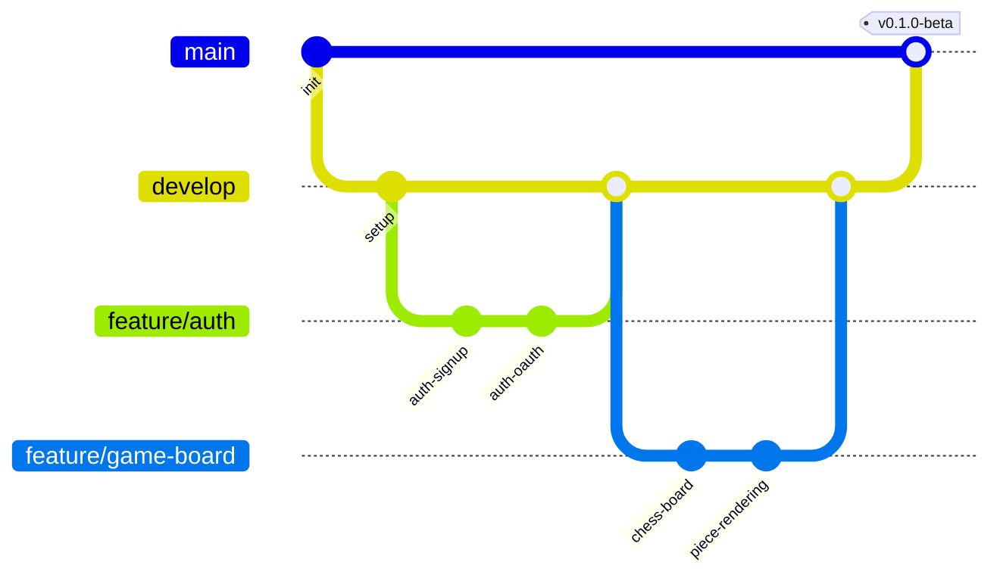

# 12. Development Workflow

[← Back to PRD Index](./readme.md) | [Previous: Configuration](./11-configuration.md) | [Next: Risks & Mitigation →](./13-risks-and-mitigation.md)

---

## 12.1 Git Strategy

### Branch Model



### Branch Naming

| Type | Pattern | Example |
|------|---------|---------|
| Feature | `feature/<area>-<description>` | `feature/morale-system` |
| Bug fix | `fix/<description>` | `fix/morale-clamping` |
| Hotfix | `hotfix/<description>` | `hotfix/ai-fallback` |
| Chore | `chore/<description>` | `chore/update-deps` |
| Docs | `docs/<description>` | `docs/api-endpoints` |

### Branch Rules

- `main` — Protected. Requires PR + 1 approval + all checks passing. Deployed to production on release tag.
- `develop` — Integration branch. Requires PR + all checks passing. Deployed to staging.
- Feature branches — Created from `develop`, merged back via PR.

---

## 12.2 Commit Standards

### Conventional Commits

```
<type>(<scope>): <description>

[optional body]

[optional footer(s)]
```

**Types:**

| Type | Use |
|------|-----|
| `feat` | New feature |
| `fix` | Bug fix |
| `docs` | Documentation |
| `style` | Formatting (no logic change) |
| `refactor` | Code restructuring |
| `test` | Adding/updating tests |
| `chore` | Build, tooling, deps |
| `perf` | Performance improvement |

**Examples:**
```
feat(morale): add idle penalty after 5 turns
fix(persuasion): clamp probability between 0 and 1
test(chess-engine): add checkmate detection tests
docs(api): document persuasion endpoint response model
```

---

## 12.3 Pull Request Process

### PR Template

```markdown
## Description
<!-- What does this PR do? -->

## Type of Change
- [ ] Feature
- [ ] Bug fix
- [ ] Refactor
- [ ] Documentation

## Checklist
- [ ] Code follows project style guidelines
- [ ] Self-review completed
- [ ] Tests added/updated
- [ ] No new linting warnings
- [ ] Documentation updated (if applicable)
- [ ] Accessibility checked (if UI change)

## Screenshots (if UI change)
<!-- Add before/after screenshots -->

## Related Issues
<!-- Link to issue(s) this PR addresses -->
```

---

## 12.4 Code Standards

### TypeScript (Frontend)

- **Strict mode** enabled (`strict: true` in tsconfig)
- No `any` types (use `unknown` + type guards)
- Prefer `interface` over `type` for object shapes
- Props defined with `React.FC<Props>` or explicit return types
- All exports named (no default exports except pages)
- `// TODO:` comments must include a ticket/issue reference

### Python (Backend)

- Type hints on all function signatures and return values
- Docstrings on all public functions (Google style)
- `async def` for all I/O-bound operations
- Pydantic models for all request/response validation
- No bare `except:` — always catch specific exceptions

### Shared

- Max line length: 100 chars (Python), configurable (TypeScript)
- No console.log / print statements in production code
- Constants over magic numbers
- File names: kebab-case (frontend), snake_case (backend)

---

## 12.5 Pre-commit Hooks

```json
// frontend/package.json (lint-staged)
{
  "lint-staged": {
    "*.{ts,tsx}": ["eslint --fix", "prettier --write"],
    "*.css": ["prettier --write"]
  }
}
```

```yaml
# backend/.pre-commit-config.yaml
repos:
  - repo: https://github.com/astral-sh/ruff-pre-commit
    rev: v0.3.0
    hooks:
      - id: ruff
        args: [--fix]
  - repo: https://github.com/psf/black
    rev: 24.2.0
    hooks:
      - id: black
```

---

## 12.6 Local Development Setup

```bash
# Clone
git clone https://github.com/team/chessalive.git
cd chessalive

# Frontend
cd frontend
cp .env.example .env  # Fill in Supabase keys
npm install
npm run dev            # http://localhost:5173

# Backend (new terminal)
cd backend
cp .env.example .env   # Fill in all keys
python -m venv .venv
source .venv/bin/activate
pip install -r requirements.txt
uvicorn app.main:app --reload --port 8000

# Supabase Local (new terminal)
supabase start         # Requires Docker
supabase db reset      # Apply migrations
```

---

## 12.7 Documentation

| Document | Location | Purpose |
|----------|----------|---------|
| `README.md` | Root | Project overview, setup instructions |
| `prd/` | `/prd/` | This PRD (product requirements) |
| API docs | Auto-generated | FastAPI Swagger UI at `/docs` |
| ADRs | `/docs/adr/` | Architecture Decision Records |
| Changelog | `CHANGELOG.md` | Version history (auto-generated from commits) |

---

[← Back to PRD Index](./readme.md) | [Previous: Configuration](./11-configuration.md) | [Next: Risks & Mitigation →](./13-risks-and-mitigation.md)
